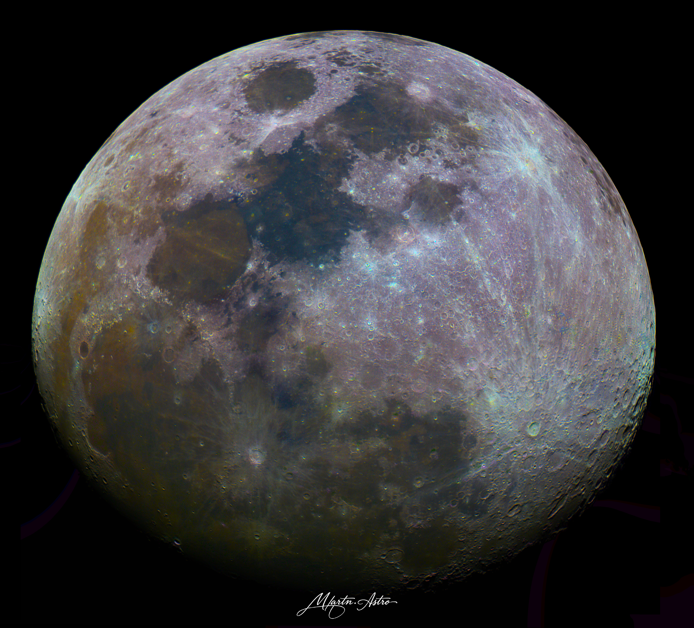
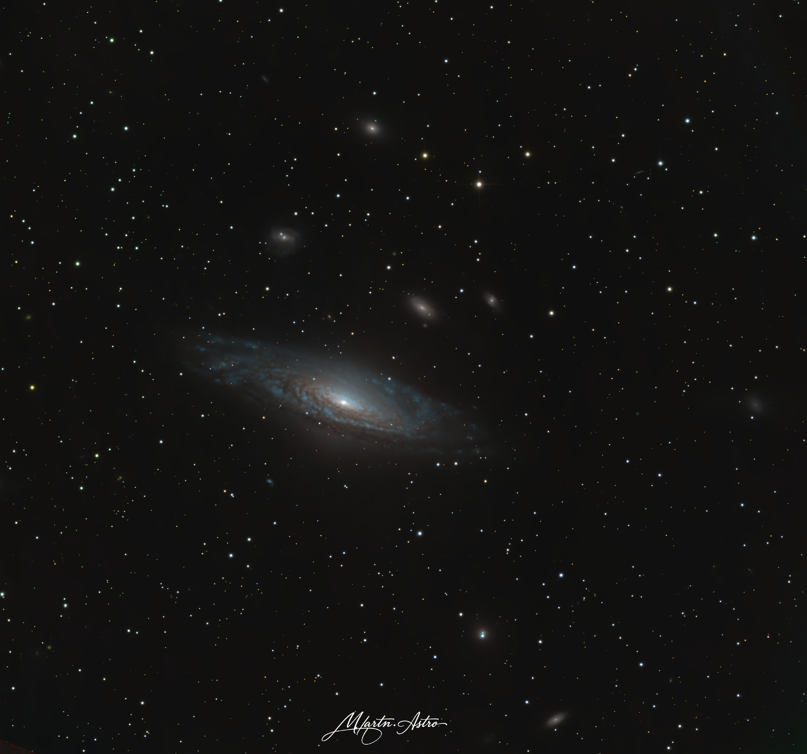
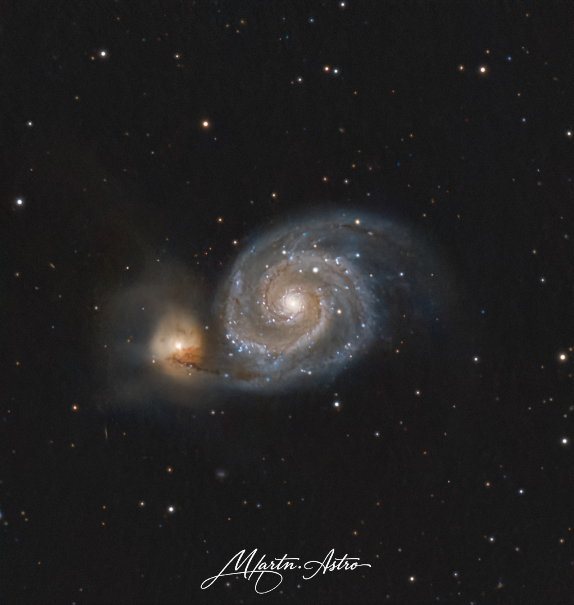

# 🌌 Hello, I'm Martin | martn.astro
**Astrophysics Student | Astrophotographer | Developer**

  <em>"Exploring the cosmos through code, data analysis, and the lens."</em>

---

### 🔭 What I'm Working On
- 🎓 **Studies:** Actively studying and expanding my knowledge in astrophysics and astronomy.
- 🪐 **Research:** Analyzing astronomical data, modeling celestial mechanics, and exploring stellar/galactic dynamics.
- 💻 **Computational Tools:** Building automated processing pipelines and scripts using Python and data-science libraries.
- 📸 **Astrophotography:** Capturing deep-sky objects and processing them with tools like PixInsight and Siril.

### 🛠️ Tech Stack & Cosmic Toolkit
- **Languages:** Python, C,
- **Scientific Stack:** Astropy, NumPy, SciPy, Matplotlib, Pandas
- **Astro & Imaging Tools:** Siril, Stellarium, ASCOM platform, PHD2 Guiding

### 📸 Latest Astrophotography 
*My most recent captures! (Manually upload your photos to GitHub to replace these placeholders)*

<!-- IG-START -->

  
  
  

<!-- IG-END -->

### 🚀 NASA Astronomy Picture of the Day
*Daily universe highlights.*

<!-- APOD-START -->

  
  
<b>M83: The Southern Pinwheel</b> (2026-09-11)

<!-- APOD-END -->

### 📫 Connect with Me
- 🌐 Portfolio / Website: https://it2523.sspu-opava.eu
- 📸 Instagram: [@martn.astro](https://instagram.com/martn.astro)
